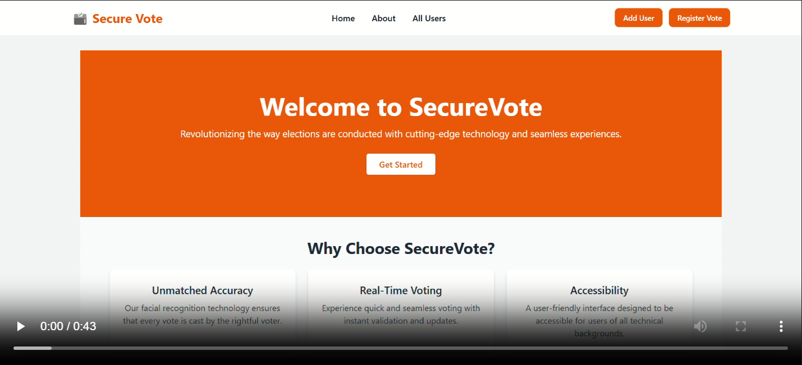
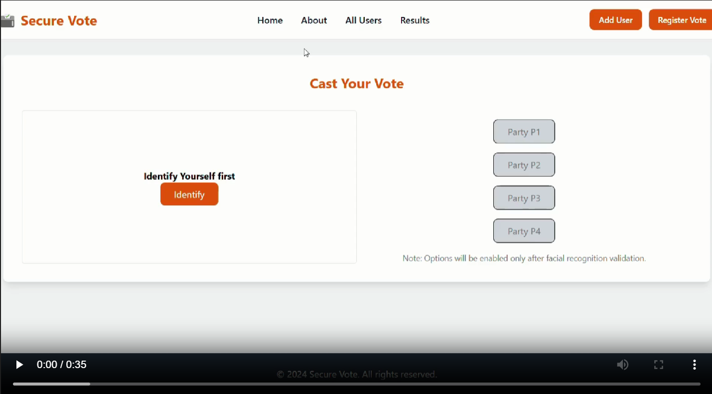

# AI Electoral Integrity Face Recognition Voting System

## Project Overview
This project aims to develop a face recognition-based voting system to ensure electoral integrity. The system leverages artificial intelligence to authenticate voters and prevent fraudulent activities.

## Features
- **Face Recognition**: Uses AI to verify voter identity.
- **Secure Voting**: Ensures that each vote is cast by a legitimate voter.
- **User-Friendly Interface**: Easy to use for both voters and administrators.
- **Real-Time Processing**: Quick and efficient voter verification.

## Installation
1. Clone the repository:
    ```bash
    git clone https://github.com/pavan347/Voting_System_Using_Facial_Recognition.git
    ```
2. Navigate to the project directory:
    ```bash
    cd Voting_System_Using_Facial_Recognition
    ```
3. Create a virtual environment:
    ```bash
    python -m venv env
    ```

4. Activate the virtual environment on Windows:
    ```bash
    .\env\Scripts\activate
    ```

5. Install the required dependencies:
    ```bash
    pip install -r requirements.txt
    ```

## Usage
1. Run the application:
    ```bash
    python app.py
    ```
2. Follow the on-screen instructions to register and vote.

## Technologies Used
- Python
- OpenCV
- TensorFlow/Keras
- Flask

## Contributing
1. Fork the repository.
2. Create a new branch:
    ```bash
    git checkout -b feature-branch
    ```
3. Make your changes and commit them:
    ```bash
    git commit -m "Description of changes"
    ```
4. Push to the branch:
    ```bash
    git push origin feature-branch
    ```
5. Create a pull request.

## Demo

- Demo video of the AI Electoral Integrity Face Recognition Voting System:
    [](./static/Project_Demo_Videos/AIEIVS.mp4)
- Demo video of the voting process:
    [](./static/Project_Demo_Videos/AIEIVS_Voting_Video.mp4)
   
## License
This project is licensed under the MIT License. See the [LICENSE](LICENSE) file for details.

## Contact
For any questions or suggestions, please contact:
- Pavan: [pavankumargarapati04@gmail.com](mailto:pavankumargarapati04@gmail.com)
